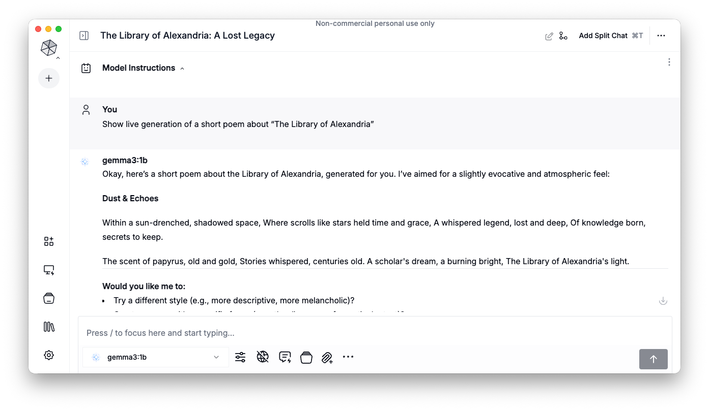
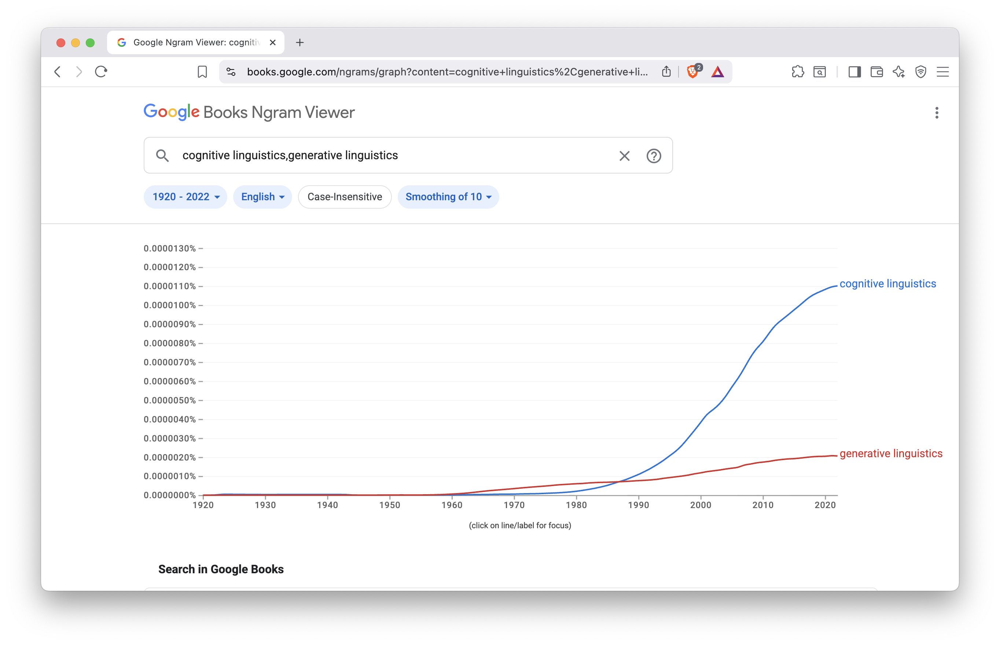
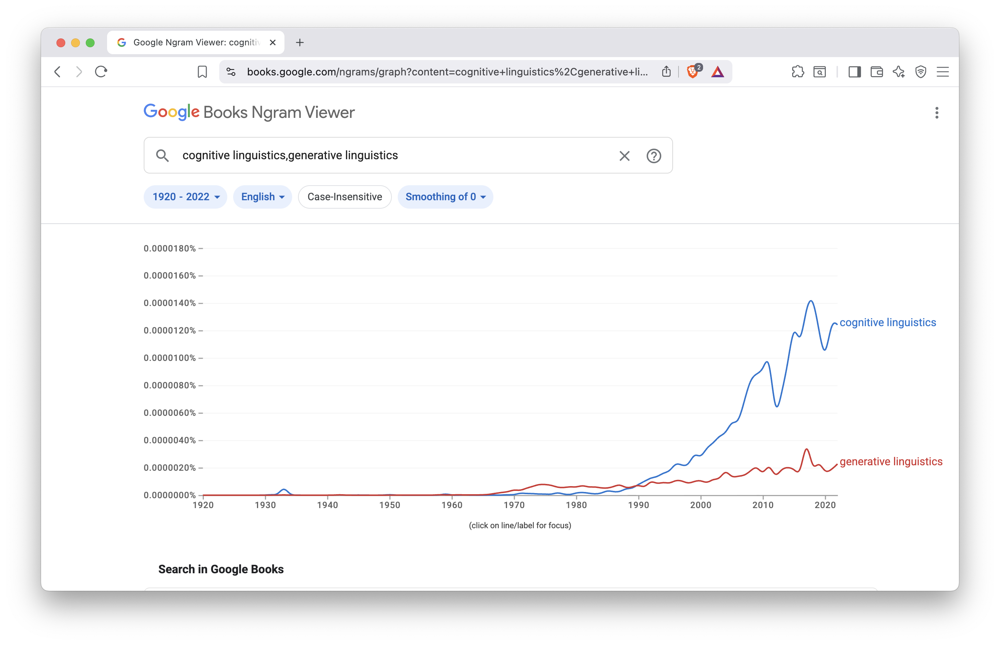
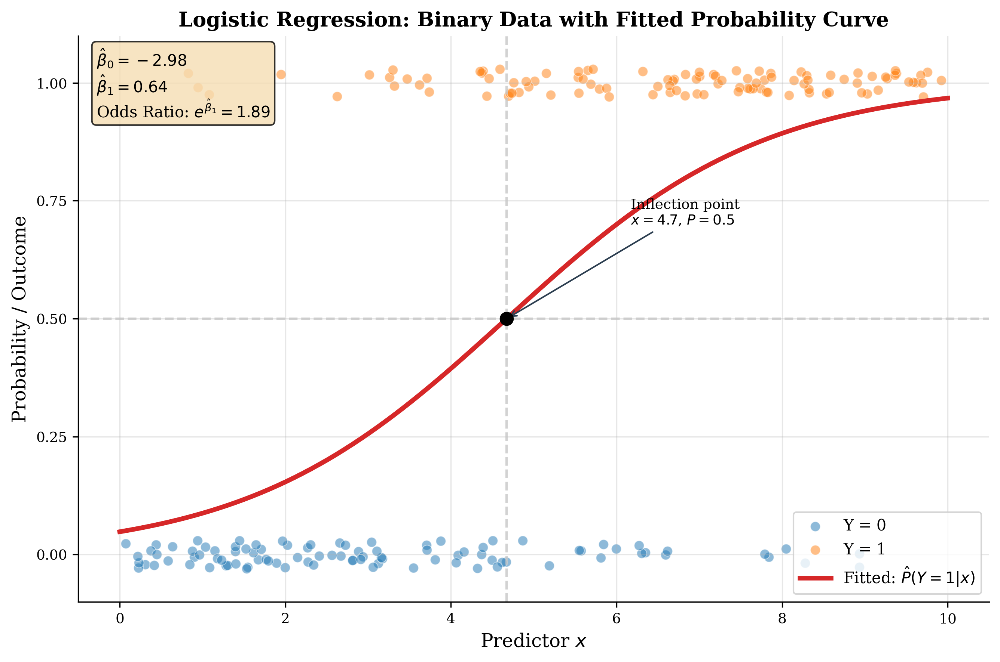

```{r setup, include=FALSE}
# set global chunk options

library(knitr)
library(plotly)
library(fmsb)

x = read.csv("R_datasets/dane_diachroniczne_2017-10-23.csv", row.names=1)
y = read.csv("R_datasets/imieslow_etc_2017-10-23.csv")

dates = as.numeric(rownames(x))

my.blue = rgb(0.15, 0.45, 0.96)
my.green = rgb(0.15, 0.85, 0.27, 0.7)
my.red = rgb(0.92, 0.3, 0.3, 0.6)
my.grey = rgb(0,0,0,.6)
my.orange = rgb(1,0.5,0.2,0.6) 
my.teal = rgb(0, 0.5, 0.5, 0.7)  #### or: my.teal = rgb(0.24, 0.65, 0.75, 0.7)
my.violet = rgb(0.75, 0.25, 0.82, 0.7)

my.p.blue = "rgba(38, 115, 245, 0.7)"
my.p.green = "rgba(38, 217,  69, 0.7)"
my.p.red = "rgba(235, 77, 77, 0.6)"
my.p.grey = "rgba(0, 0, 0, 0.6)"
my.p.orange = "rgba(255, 128, 51, 0.6)"
my.p.teal = "rgba(0, 128, 128, 0.7)"
my.p.violet = "rgba(190, 64, 210, 0.7)"

opts_chunk$set(cache=FALSE)
```


## Course overview

- simple predictive models
- multidimensional classification
- distributional semantics
- contextual embeddings (BERT)
- The Transformer (modern LLMs)
- prompt engineering
- transfer learning
- running LLMs locally
- agentic workflows


## Topics covered today

- A single (isolated) language feature at a time
- Interplay of two possibly correlated features
- Statistical modeling at a glance
- Linear regression
- Logistic regression


# Much more than chatGPT


## Chatbot


## Another chatbot




# AI is statistics on steroids


## Statistical inference and prediction

- forecasting the weather, given meteo observations
- modeling economic trends, given past days
- diagnosing a patient, given helth measurements
- diagnosing a patient, given gene expressions
- assigning sentiment scores to a sentence ('negative', 'positive')
- identifying spam, given word occurrences
- passing the "Intro do AI course", given attendance and assignments
- . . .


## Traditional models not sufficient

multivariate machine learning (e.g. SVM) fails to map a large feature space:

```{r}
DiagrammeR::grViz("digraph {
  graph [layout = dot, rankdir = TD]
  
  node [shape = rectangle, fixedsize = true, width = 4, style = filled, fillcolor = Beige]      
  box1 [label = 'Why did the banana cross the road?']
  box2 [label = 'mapping function', fillcolor = Linen, width = 2]
  box3 [label = 'Perché la banana ha attraversato la strada?']
  
  # edge definitions with the node IDs
  box1 -> box2 -> box3
  
  }")

```


## Turning points

- 1970s – artificial neural networks
- 2000s – deep learning networks
- 2013 – word embeddings (word2vec)
- 2014 – sequence mapping (seq2seq)
- 2017 – attention is all you need (The Transformer) 👈
- 2018 – pre-trained multi-language model (BERT)
- 2019 – large generative model (GPT-2)
- 2022 – a model released as a chatbot (chatGPT)
- 2023 – multimodal models
- 2024 – reasoning models 
- 2025 – compressed models (distillation, quantization)
- 2026 – agentic systems (OpenClaw, Hermes-Agent, DeepSeek Harness, ...)


# Everything is a distibution


## Frequency of the reflexive pronoun _się_

- any attempt at measuring a(ny) language feature, leads to realization:
    - the results differ when we draw a different sample
- e.g. the number of occurrences of _się_ per 10,000 words:
    - 267, 294, 339, 318, 294, 318, 213, 308, 337, 320, 333, ...
- several factors responsible for the phenomenon
    - corpus is but a proxy to language
    - language differs across registers
    - spoken language and written language differ
    - personal idiosyncrasies play a role
    - . . . 


## A language feature follows a distribution

```{r fig-0a, echo = FALSE, message = FALSE}
sie_w_100_powiesciach = c(267, 294, 339, 318, 294, 318, 213, 308, 337, 320, 333, 374, 219, 264, 248, 283, 291, 267, 278, 257, 254, 255, 236, 280, 278, 255, 298, 282, 264, 229, 279, 319, 291, 234, 290, 252, 287, 263, 294, 249, 273, 226, 299, 350, 347, 315, 277, 338, 252, 251, 207, 275, 230, 265, 250, 260, 275, 234, 266, 260, 285, 325, 308, 253, 231, 272, 216, 252, 230, 289, 255, 268, 337, 293, 289, 305, 288, 250, 255, 260, 258, 273, 244, 222, 255, 301, 266, 264, 297, 301, 312, 259, 190, 217, 277, 244, 230, 288, 310, 262)
dabrowska = c(318, 341, 308, 298, 323, 331, 315, 293, 331, 342, 301, 337, 306, 312, 336, 318, 312, 290, 326, 325, 313, 304, 313, 301, 318, 321, 326, 320, 309, 343, 327, 338, 335, 314, 320, 320, 282, 307, 342, 315, 353, 329, 355, 344, 339, 337, 326, 337, 352, 301, 315, 365, 332, 360, 319, 359, 337, 322, 357, 365)
#boxplot(sie_w_100_powiesciach, dabrowska, col = c(rgb(1,0,0,0.5), rgb(0,0,1,0.5)))
boxplot(sie_w_100_powiesciach, col = rgb(1,0,0,0.5))
```


## 100 novels vs. Maria Dąbrowska

```{r fig-0b, echo = FALSE, message = FALSE}
boxplot(sie_w_100_powiesciach, dabrowska, col = c(rgb(1,0,0,0.5), rgb(0,0,1,0.5)))
```


# When two variables interact


## Pronouns vs. adjectives


```{r fig-1a, echo = FALSE, message = FALSE}
txt = readLines("R_datasets/Austen_Pride_tagged.txt")
sentences = lapply(txt, function(x) unlist(strsplit(unlist(strsplit(x, " ")), ".*_")))
NN = unlist(lapply(sentences, function(y) length(grep("NN", y))))
PR = unlist(lapply(sentences, function(y) length(grep("PR", y))))
JJ = unlist(lapply(sentences, function(y) length(grep("JJ", y))))
DT = unlist(lapply(sentences, function(y) length(grep("DT", y))))

p = plot_ly(x = jitter(PR), y = jitter(JJ), name = 'NN vs VB', type = 'scatter', mode = 'markers') %>%
       layout(
           xaxis = list(range = c(0, 23)),
           yaxis = list(range = c(0, 15), zeroline = FALSE))
p
```

## Nouns require (?) a determiner

```{r fig-1b, echo = FALSE, message = FALSE}
p = plot_ly(x = jitter(NN), y = jitter(DT), name = 'NN vs DT', type = 'scatter', mode = 'markers') %>%
       layout(
           xaxis = list(range = c(0, 42)),
           yaxis = list(range = c(0, 20), zeroline = FALSE))
p
```


## Google ngram viewer 

<!--
<iframe name="ngram_chart" src="https://books.google.com/ngrams/interactive_chart?content=cognitive+linguistics,generative+linguistics&year_start=1920&year_end=2022&corpus=en&smoothing=10" width=900 height=500 marginwidth=0 marginheight=0 hspace=0 vspace=0 frameborder=0 scrolling=no></iframe>
-->




## Ngram viewer: actual datapoints

<!--
<iframe name="ngram_chart" src="https://books.google.com/ngrams/interactive_chart?content=cognitive+linguistics,generative+linguistics&year_start=1920&year_end=2022&corpus=en&smoothing=0" width=900 height=500 marginwidth=0 marginheight=0 hspace=0 vspace=0 frameborder=0 scrolling=no></iframe>
-->




# Towards a model


## Adverbial participle decays

- Intuitively, we realize the change
- No quantitative methods needed
- But: what is the _dynamics_ of that particular change?

> Lepiej miernie być grzecznym a długo, niż oraz i nazbyt, a krotko (rzeczono na tych, którzy dla lekkiej chluby na wielkie koszty **wyciągnąwszy się**, potym nic nie mają).


## Adverbial participle

```{r fig-2, echo = FALSE, message = FALSE}
wynik = y$imieslow / y$dlugosc
sredni.wynik = c()
for(i in unique(y$rok)[107:323]) {
   sredni.wynik = c( sredni.wynik, mean(wynik[y$rok == i]) )
}
p = plot_ly(x = unique(y$rok)[107:323], y = sredni.wynik, name = 'imiesłów uprzedni', type = 'scatter', mode = 'markers') %>%
       add_trace(y = lowess(sredni.wynik, f=1/5)$y, name = 'imiesłów uprzedni', mode = 'lines', line = list(width = 0)) %>%
       layout(
           xaxis = list(range = c(1650, 2020)),
           yaxis = list(range = c(-0.001, 0.01), zeroline = FALSE))
p

``` 


## Adverbial participle: trend line

```{r fig-2a, echo = FALSE, message = FALSE}
wynik = y$imieslow / y$dlugosc
sredni.wynik = c()
for(i in unique(y$rok)[107:323]) {
   sredni.wynik = c( sredni.wynik, mean(wynik[y$rok == i]) )
}
p = plot_ly(x = unique(y$rok)[107:323], y = sredni.wynik, name = 'imiesłów uprzedni', type = 'scatter', mode = 'markers') %>%
       add_trace(y = lowess(sredni.wynik, f=1/5)$y, name = 'imiesłów uprzedni', mode = 'lines', line = list(width = 3)) %>%
       layout(
           xaxis = list(range = c(1650, 2020)),
           yaxis = list(range = c(-0.001, 0.01), zeroline = FALSE))
p
```


## Adverbial participle: linear model

```{r fig-3b, echo = FALSE, message = FALSE}
wynik = y$imieslow / y$dlugosc
sredni.wynik = c()
for(i in unique(y$rok)[107:323]) {
   sredni.wynik = c( sredni.wynik, mean(wynik[y$rok == i]) )
}

model_korpus = lm(sredni.wynik ~ unique(y$rok)[107:323])

p = plot_ly(x = unique(y$rok)[107:323], y = sredni.wynik, name = 'imiesłów uprzedni', type = 'scatter', mode = 'markers') %>%
       add_trace(y = model_korpus$fitted.values, name = 'imiesłów uprzedni', mode = 'lines', line = list(width = 3)) %>%
       layout(
           xaxis = list(range = c(1650, 2020)),
           yaxis = list(range = c(-0.001, 0.01), zeroline = FALSE))
p
```


## Statistical jargon...

```{r echo = FALSE, message = TRUE}
participle = sredni.wynik
year = unique(y$rok)[107:323]
model_korpus = lm(participle ~ year)
summary(model_korpus)
```


## Mathematical jargon...

Linear regression model, general equation:

$$ y = \alpha + \beta x $$

Linear regression model to predict the frequency of participles:

$$ f(participle) =  -9.146 \times 10^{-6} \times year + 0.0191 $$


# linear regression


## Old Faithful: a geyser in Yellowstone

<p><a href="https://commons.wikimedia.org/wiki/File:Yellowstone_National_Park_(WY,_USA),_Old_Faithful_Geyser_--_2022_--_2599.jpg#/media/File:Yellowstone_National_Park_(WY,_USA),_Old_Faithful_Geyser_--_2022_--_2599.jpg"></a></p>


## Old Faithful: a dataset

```{r}
faithful[1:20,]
```

Can we _**predict**_ the duration of the next eruption?


## dependence of two variables

```{r}
plot(faithful$eruptions ~ faithful$waiting, ylab = "eruption time [minutes]", xlab = "waiting time [minutes]")
```

## trendline aka model

```{r}
plot(faithful$eruptions ~ faithful$waiting, ylab = "eruption time [minutes]", xlab = "waiting time [minutes]")
model = lm(faithful$eruptions ~ faithful$waiting)
abline(model, col = rgb(1,0,0,0.6), lwd = 5)
```

## Statistical jargon...

```{r}
summary(model)
```


## Mathematical jargon...

Linear regression model to predict the length of an eruption:

$$ t_{eruption} =  0.075 \times t_{waiting} -1.874 $$


## Linear regression model

$$ y = \alpha + \beta x $$


## Predicting new values


```{r}
plot(faithful$eruptions ~ faithful$waiting, ylab = "eruption time [minutes]", xlab = "waiting time [minutes]")
model = lm(faithful$eruptions ~ faithful$waiting)
abline(model, col = rgb(1,0,0,0.6), lwd = 5)
points(60, 60 * 0.075 -1.874, col ="blue", lwd = 5)
```


## Mathematical model

- Can we describe patterns with a formalized language?
- Model: an ideal representation of actual data.
- Model: a compression of data: it cannot be reverted.
- How to interpret the observations not fitting the model:
    - imperfections of the world?
    - _langue_ only partially accessible via _parole_?
    - confound factors involved?


## More than one predictor

- can we prepare, say, a weather forecast by modeling just one variable?
- different variables might be useful (temp, pressure, wind, ...)
- historical values of each variable might be useful, too
- the prediction dependent on the 'memory' of the variable


## Linear regression with a few predictors

```{r}
fit_swiss <- lm(Fertility ~ Agriculture + Examination + Education +
                  Catholic + Infant.Mortality, data = swiss)
summary(fit_swiss)
```


# Not always linear


## Adverbial participle again 😩

```{r fig-3c, echo = FALSE, message = FALSE}
wynik = y$imieslow / y$dlugosc
sredni.wynik = c()
for(i in unique(y$rok)[107:323]) {
   sredni.wynik = c( sredni.wynik, mean(wynik[y$rok == i]) )
}

model_korpus = lm(sredni.wynik ~ unique(y$rok)[107:323])

p = plot_ly(x = unique(y$rok)[107:323], y = sredni.wynik, name = 'imiesłów uprzedni', type = 'scatter', mode = 'markers') %>%
       add_trace(y = model_korpus$fitted.values, name = 'imiesłów uprzedni', mode = 'lines', line = list(width = 3)) %>%
       layout(
           xaxis = list(range = c(1650, 2020)),
           yaxis = list(range = c(-0.001, 0.01), zeroline = FALSE))
p
```


## Adverbial participle: bigger picture

```{r fig-3, echo = FALSE, message = FALSE}
wynik = y$imieslow / y$dlugosc
sredni.wynik = c()
for(i in unique(y$rok)) {
   sredni.wynik = c( sredni.wynik, mean(wynik[y$rok == i]) )
}

model_korpus = lm(sredni.wynik ~ unique(y$rok)) #, weights = dlugosc_korpus)

library(mgcv)
mod_gam = gam(sredni.wynik ~ s( unique(y$rok), bs = "cr"))  #, weights = dlugosc_korpus)
#lines(mod_gam$fitted.values ~ daty_korpus, col = rgb(1, 0, 0, 0.6), lwd = 5)


p = plot_ly(x = unique(y$rok), y = sredni.wynik, name = 'imiesłów uprzedni', type = 'scatter', mode = 'markers') %>%
       #add_trace(y = model_korpus$fitted.values, name = 'imiesłów uprzedni', mode = 'lines', line = list(width = 3)) %>%
       add_trace(y = mod_gam$fitted.values, name = 'imiesłów uprzedni', mode = 'lines', line = list(width = 3)) %>%
       layout(
           xaxis = list(range = c(1350, 2020)),
           yaxis = list(range = c(-0.001, 0.01), zeroline = FALSE))
p
```


# It gets complex at times


## Conjunction _że_ (= _that_-clauses)

```{r fig-4, echo = FALSE, message = FALSE}
wynik = y$ze / y$dlugosc
sredni.wynik = c()
for(i in unique(y$rok)) {
   sredni.wynik = c( sredni.wynik, mean(wynik[y$rok == i]) )
}
mod_gam = gam(sredni.wynik ~ s( unique(y$rok), bs = "cr"))  #, weights = dlugosc_korpus)
p = plot_ly(x = unique(y$rok), y = sredni.wynik, name = 'spójnik że', type = 'scatter', mode = 'markers') %>%
       #add_trace(y = lowess(sredni.wynik, f=1/2)$y, name = 'spójnik że', mode = 'lines', line = list(width = 3)) %>%
       add_trace(y = mod_gam$fitted.values, name = 'spójnik że', mode = 'lines', line = list(width = 3)) %>%
       layout(
           xaxis = list(range = c(1350, 2020)),
           yaxis = list(zeroline = FALSE))
p
```


## Hold on...

* the conjunction _że_ used to have its synonyms
* namely, the conjunction _iż_ (_iże_, _hiż_, _hiże_)
* lots of examples, even in the early centuries


## Conjunction _iż_

```{r fig-4a, echo = FALSE, message = FALSE}
wynik = y$iz / y$dlugosc
sredni.wynik = c()
for(i in unique(y$rok)) {
   sredni.wynik = c( sredni.wynik, mean(wynik[y$rok == i]) )
}
mod_gam = gam(sredni.wynik ~ s( unique(y$rok), bs = "cr"))  #, weights = dlugosc_korpus)
p = plot_ly(x = unique(y$rok), y = sredni.wynik, name = 'spójnik iż(e)', type = 'scatter', mode = 'markers') %>%
       add_trace(y = mod_gam$fitted.values, name = 'spójnik że', mode = 'lines', line = list(width = 3)) %>%
       layout(
           xaxis = list(range = c(1350, 2020)),
           yaxis = list(zeroline = FALSE))
p
```


## Conjunctions _że_ / _iż_

```{r fig-5, echo = FALSE, message = FALSE}
wynik = y$ze / y$dlugosc
sredni.wynik = c()
for(i in unique(y$rok)) {
   sredni.wynik = c( sredni.wynik, mean(wynik[y$rok == i]) )
}
wynik = y$iz / y$dlugosc
sredni.wynik.iz = c()
for(i in unique(y$rok)) {
   sredni.wynik.iz = c( sredni.wynik.iz, mean(wynik[y$rok == i]) )
}

mod_gam = gam(sredni.wynik ~ s( unique(y$rok), bs = "cr"))  #, weights = dlugosc_korpus)
mod_gam_iz = gam(sredni.wynik.iz ~ s( unique(y$rok), bs = "cr"))  #, weights = dlugosc_korpus)

p = plot_ly(x = unique(y$rok), y = mod_gam$fitted.values, name = 'spójnik że', mode = 'lines', line = list(width = 3)) %>% 
       add_trace(y = mod_gam$fitted.values, name = 'spójnik że', mode = 'lines', line = list(width = 3)) %>%
       add_trace(y = mod_gam_iz$fitted.values, name = 'spójnik iż(e)', mode = 'lines', line = list(color = my.p.green, width = 3)) %>%
       layout(
           xaxis = list(range = c(1350, 2020)),
           yaxis = list(zeroline = FALSE))
p
```


# Logistic regression


## Dynamics of language change

* Linear evolution
* Sudden earthquake (e.g. a word takes over suddenly)
* Phase change
    * one word is being pushed away by another words
    * we can measure the proportion of the two forms over time
    * e.g. _iż_ -- 100% in 1400, 27% in 1645, 1% in 1990 etc.
* Can we model the change mathematically?


## But first, a conceptual model

* the change begins among a small group of people
* it gradually "affects" other people
* then the change accelerates
* still, some conservative users stick to the old form
* but sooner or later, they will all die


## Piotrowski's law

* Piotrovskaja, A.A. & Piotrovskij, R.G. (1974). Matematičeskie modeli v diachronii i tekstoobrazovanii. w: _Statistika reči i avtomatičeskij analiz teksta_, 361-400. Leningrad: Nauka. 
* conceptually: this is a logistic regression
* mathematical model:

$$p(y) = \frac{1}{1 + e^{-(a + bx)}}$$


## The changes to be scrutinized

* więtszy > większy
* -bychmy, -bych > -byśmy, -bym
* barzo > bardzo 
* na- > naj- 
* iż(e) / że
* wszytko > wszystko 
* abo > albo 

[**Górski, R. L. and Eder, M.** (2023). Modeling the dynamics of language change: logistic regression, Piotrowski’s law, and a handful of examples in Polish. _Journal of Quantitative Linguistics_, 30(1): 125–51]


## Corpus (_in statu nascendi..._)

* coverage: 1380--2010
* some periods better represented
* 1021 texts
* 25 mln words
* opportunistic
* no grammatical annotation so far


## Corpus: coverage

```{r fig-1, echo = FALSE, message = FALSE}
sredni.wynik = c()
for(i in unique(y$rok)) {
   sredni.wynik = c( sredni.wynik, sum(y$dlugosc[y$rok == i]) )
}
suppressWarnings(library(bindrcpp))
p = plot_ly(x = unique(y$rok), y = sredni.wynik, name = 'number of words', type = 'bar') %>%
       layout(
           xaxis = list(range = c(1350, 2050)),
           yaxis = list(zeroline = FALSE))
p
```


## _więtszy_ > _większy_

```{r fig-10, echo = FALSE, message = FALSE}
model = glm(x$wiekszy ~ dates, family=quasibinomial(logit))
r2 = round(NagelkerkeR2(model)$R2, 3)
annotation <- list(x = 2020, y = 0.1, text = paste("<i>R</i><sup>2</sup> = ", r2), showarrow = F)
p = plot_ly(x = dates, y = x$wiekszy, name = 'więtszy > większy', type = 'scatter', mode = 'markers') %>%
       add_trace(y = model$fitted, name = 'więtszy > większy', mode = 'lines', line = list(color = my.p.blue, width = 3)) %>%
       layout(
           xaxis = list(range = c(1350, 2020)),
           yaxis = list(range = c(-0.1, 1.1), zeroline = FALSE),
           annotations = annotation)
p
```


## _-bychmy_, _-bych_ > _-byśmy_, _-bym_

```{r fig-11, echo = FALSE, message = FALSE}
model = glm(x$bysmy_bym ~ dates, family=quasibinomial(logit))
r2 = round(NagelkerkeR2(model)$R2, 3)
annotation <- list(x = 2020, y = 0.1, text = paste("<i>R</i><sup>2</sup> = ", r2), showarrow = F)
p = plot_ly(x = dates, y = x$bysmy_bym, name = '-bychmy > -byśmy', type = 'scatter', mode = 'markers') %>%
       add_trace(y = model$fitted, name = '-bychmy > -byśmy', mode = 'lines', line = list(color = my.p.green, width = 3)) %>%
       layout(
           xaxis = list(range = c(1350, 2020)),
           yaxis = list(range = c(-0.1, 1.1), zeroline = FALSE),
           annotations = annotation)
p
```


## _barzo-_ > _bardzo_

```{r fig-12, echo = FALSE, message = FALSE}
model = glm(x$bardzo ~ dates, family=quasibinomial(logit))
r2 = round(NagelkerkeR2(model)$R2, 3)
annotation <- list(x = 2020, y = 0.1, text = paste("<i>R</i><sup>2</sup> = ", r2), showarrow = F)
p = plot_ly(x = dates, y = x$bardzo, name = 'barzo > bardzo', type = 'scatter', mode = 'markers') %>%
       add_trace(y = model$fitted, name = 'barzo > bardzo', mode = 'lines', line = list(color = my.p.red, width = 3)) %>%
       layout(
           xaxis = list(range = c(1350, 2020)),
           yaxis = list(range = c(-0.1, 1.1), zeroline = FALSE),
           annotations = annotation)
p
```


## _na-_ > _naj-_

```{r fig-13, echo = FALSE, message = FALSE}
model = glm(x$naj ~ dates, family=quasibinomial(logit))
r2 = round(NagelkerkeR2(model)$R2, 3)
annotation <- list(x = 2020, y = 0.1, text = paste("<i>R</i><sup>2</sup> = ", r2), showarrow = F)
p = plot_ly(x = dates, y = x$naj, name = 'na- > naj-', type = 'scatter', mode = 'markers') %>%
       add_trace(y = model$fitted, name = 'na- > naj-', mode = 'lines', line = list(color = my.p.grey, width = 3)) %>%
       layout(
           xaxis = list(range = c(1350, 2020)),
           yaxis = list(range = c(-0.1, 1.1), zeroline = FALSE),
           annotations = annotation)
p
```


## _iż(e)_ / _że_

```{r fig-14, echo = FALSE, message = FALSE}
model = glm(x$ze ~ dates, family=quasibinomial(logit))
r2 = round(NagelkerkeR2(model)$R2, 3)
annotation <- list(x = 2020, y = 0.1, text = paste("<i>R</i><sup>2</sup> = ", r2), showarrow = F)
p = plot_ly(x = dates, y = x$ze, name = 'iż(e) / że', type = 'scatter', mode = 'markers') %>%
       add_trace(y = model$fitted, name = 'iż(e) / że', mode = 'lines', line = list(color = my.p.orange, width = 3)) %>%
       layout(
           xaxis = list(range = c(1350, 2020)),
           yaxis = list(range = c(-0.1, 1.1), zeroline = FALSE),
           annotations = annotation)
p
```


## _wszytko_ > _wszystko_

```{r fig-15, echo = FALSE, message = FALSE}
model = glm(x$wszystko ~ dates, family = quasibinomial(logit))
model1 = glm(x$wszystko ~ poly(dates, 4), family = quasibinomial(logit))
r2 = round(NagelkerkeR2(model)$R2, 3)
annotation <- list(x = 2020, y = 0.1, text = paste("<i>R</i><sup>2</sup> = ", r2), showarrow = F)
p = plot_ly(x = dates, y = x$wszystko, name = 'wszytko > wszystko', type = 'scatter', mode = 'markers') %>%
       add_trace(y = model$fitted, name = 'wszytko > wszystko', mode = 'lines', line = list(color = my.p.teal, width = 3, dash = 'dash')) %>%
       #add_trace(y = lowess(x$wszystko, f=1/7)$y, name = 'wszytko > wszystko', mode = 'lines', line = list(color = my.p.teal, width = 3)) %>%
       add_trace(y = model1$fitted, name = 'wszytko > wszystko', mode = 'lines', line = list(color = my.p.teal, width = 3)) %>%       layout(
           xaxis = list(range = c(1350, 2020)),
           yaxis = list(range = c(-0.1, 1.1), zeroline = FALSE),
           annotations = annotation)
p
```


# Does the model always work?


## _abo_ > _albo_

```{r fig-16, echo = FALSE, message = FALSE}
model = glm(x$albo ~ dates, family = quasibinomial(logit))
model1 = glm(x$albo ~ poly(dates, 6), family = quasibinomial(logit))
r2 = round(NagelkerkeR2(model)$R2, 3)
annotation <- list(x = 2020, y = 0.1, text = paste("<i>R</i><sup>2</sup> = ", r2), showarrow = F)
p = plot_ly(x = dates, y = x$albo, name = 'abo > albo', type = 'scatter', mode = 'markers') %>%
#       add_trace(y = model$fitted, name = 'abo > albo', mode = 'lines', line = list(color = my.p.violet, width = 3, dash = 'dash'))  %>%
       add_trace(y = model1$fitted, name = 'abo > albo', mode = 'lines', line = list(color = my.p.violet, width = 3)) %>%
       layout(
           xaxis = list(range = c(1350, 2020)),
           yaxis = list(range = c(-0.1, 1.1), zeroline = FALSE),
           annotations = annotation)
p
```


## Conclusions

- Logistic regression = a transformed linear regression
- Suitable to model a binary variable (e.g. the proportion of _A_ vs. _B_)
- Useful to explain a certain type of language change
- Also: useful to explore languages in contact
- Can be further generalized, to address categorial variables


## Logistic regression: recap




# Why it matters for AI

## Neural Networks = lots of logistic models


#


